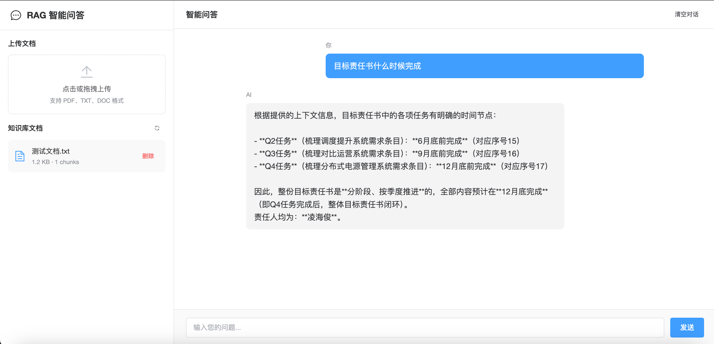

# RAG 智能问答系统

基于 Spring AI + 通义千问 + Milvus 的检索增强生成（RAG）智能问答系统。

## 截图



## 项目结构

```
.
├── rag-backend/          # 后端服务 (Spring Boot 3)
├── rag-frontend/         # 前端应用 (Vue 3 + Vite)
```

## 技术栈

### 后端
- **框架**: Spring Boot 3.3.0
- **AI**: Spring AI 1.1.0 + Spring AI Alibaba (通义千问/DashScope)
- **向量数据库**: Milvus 2.3.3
- **关系数据库**: MySQL
- **文档解析**: Apache Tika 2.9.1
- **连接池**: Druid

### 前端
- **框架**: Vue 3.5
- **构建工具**: Vite 5
- **UI 组件**: Element Plus 2.13
- **HTTP 客户端**: Axios

## 功能特性

- 文档上传与解析（支持多种格式：PDF、Word、TXT 等）
- 文档内容向量化存储
- 基于语义相似度的智能检索
- 基于文档内容的智能问答

## 快速开始

### 前置条件

- JDK 17+
- Node.js 18+
- MySQL 8.0+
- Docker & Docker Compose

### 1. 启动 Milvus 向量数据库

```bash
docker-compose -f docker-compose.yml up -d
```

### 2. 初始化 MySQL 数据库

```bash
mysql -u root -p < rag-backend/init.sql
```

### 3. 配置后端

编辑 `rag-backend/src/main/resources/application.yml`：

```yaml
spring:
  datasource:
    username: root
    password: your_mysql_password  # 修改为你的 MySQL 密码
    url: jdbc:mysql://localhost:3306/kris_rag2
  
  ai:
    dashscope:
      api-key: ${TONGYI_API_KEY:your_api_key}  # 修改为你的通义千问 API Key
```

### 4. 启动后端服务

```bash
cd rag-backend
./mvnw spring-boot:run
```

后端服务将在 http://localhost:8080 启动。

### 5. 启动前端应用

```bash
cd rag-frontend
npm install
npm run dev
```

前端应用将在 http://localhost:5173 启动。

## API 接口

| 方法 | 路径 | 描述 |
|------|------|------|
| POST | `/api/documents` | 上传文档 |
| GET | `/api/documents` | 获取文档列表 |
| DELETE | `/api/documents/{id}` | 删除文档 |
| POST | `/api/chat` | 智能问答 |

### 示例请求

```bash
# 上传文档
curl -X POST http://localhost:8080/api/documents \
  -F "file=@document.pdf"

# 智能问答
curl -X POST http://localhost:8080/api/chat \
  -H "Content-Type: application/json" \
  -d '{"message": "这份文档主要讲了什么？"}'
```

## 配置说明

### Milvus 配置

| 参数 | 默认值 | 描述 |
|------|--------|------|
| `host` | localhost | Milvus 服务地址 |
| `port` | 19530 | Milvus 服务端口 |
| `collection-name` | rag_vectors | 向量集合名称 |
| `embedding-dimension` | 1024 | 向量维度 |
| `metric-type` | COSINE | 相似度度量 |

### 通义千问 API Key 获取

1. 访问 [阿里云 DashScope 控制台](https://dashscope.console.aliyun.com/)
2. 开通服务并创建 API Key
3. 将 API Key 配置到 `application.yml` 或设置环境变量 `TONGYI_API_KEY`

## 架构说明

```
┌─────────────┐     ┌─────────────┐     ┌─────────────┐
│   前端 Vue  │────▶│  后端 API   │────▶│   通义千问   │
└─────────────┘     └─────────────┘     └─────────────┘
                           │
          ┌────────────────┼────────────────┐
          ▼                ▼                ▼
    ┌──────────┐    ┌──────────┐    ┌──────────┐
    │  MySQL   │    │  Milvus  │    │   Tika   │
    │ (文档元数据)│    │ (向量存储)│    │ (文档解析)│
    └──────────┘    └──────────┘    └──────────┘
```

### 工作流程

1. **文档上传**: 用户上传文档，Tika 解析文档内容
2. **向量化**: 文档内容通过通义千问 Embedding 模型转换为向量
3. **存储**: 文档元数据存入 MySQL，向量存入 Milvus
4. **问答**: 用户提问 → 向量检索相关文档 → 构建上下文 → 通义千问生成回答

## 开发指南

### 后端开发

```bash
cd rag-backend
./mvnw compile        # 编译
./mvnw test           # 测试
./mvnw spring-boot:run  # 运行
```

### 前端开发

```bash
cd rag-frontend
npm run dev     # 开发模式
npm run build   # 构建生产版本
npm run preview # 预览生产版本
```

## 许可证

MIT License
